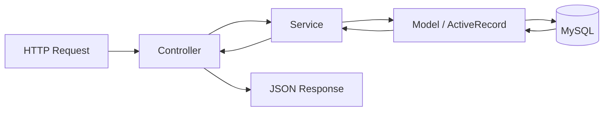
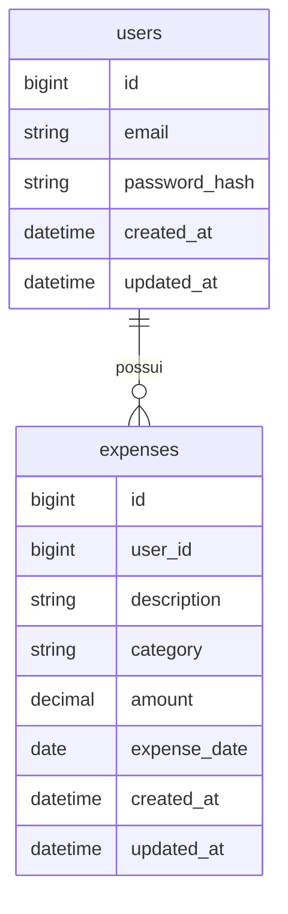

# Personal Expense Manager API

API RESTful para gerenciamento de despesas pessoais desenvolvida com PHP e Yii2. A aplicação permite cadastro e autenticação de usuários, gerenciamento completo de despesas, filtros por categoria e período, ordenação por data e controle de acesso baseado em JWT, garantindo que cada usuário tenha acesso apenas aos próprios registros.

## Índice

- [Sobre o projeto](#sobre-o-projeto)
- [Como executar](#como-executar)
- [Dados para teste](#dados-para-teste)
- [Diferenciais](#diferenciais)
- [Tecnologias utilizadas](#tecnologias-utilizadas)
- [Arquitetura](#arquitetura)
- [Estrutura de pastas](#estrutura-de-pastas)
- [Modelo de domínio](#modelo-de-domínio)
- [Regras de negócio](#regras-de-negócio)
- [Princípios SOLID](#princípios-solid)
- [Decisões técnicas](#decisões-técnicas)
- [Deploy](#deploy)
- [Documentação da API](#documentação-da-api)
- [Testes](#testes)
- [Coleção Postman](#coleção-postman)
- [Checklist de desenvolvimento](#checklist-de-desenvolvimento)
- [Contato](#contato)

## Sobre o projeto

A aplicação permite que usuários gerenciem suas despesas pessoais por meio de uma API RESTful.

Cada usuário possui uma conta própria e, após autenticação, pode cadastrar, consultar, editar e excluir despesas, além de filtrá-las por categoria e período e ordená-las por data.

O projeto prioriza organização de código, separação de responsabilidades, reutilização de componentes e boas práticas de arquitetura.

### Funcionalidades

- Cadastro de usuários
- Autenticação utilizando JWT
- CRUD completo de despesas
- Controle de acesso por usuário
- Filtro por categoria
- Filtro por período
- Ordenação por data
- Paginação

## Como executar

### Pré-requisitos

- Docker
- Docker Compose

### Configurar variáveis de ambiente

Antes de executar a aplicação, copie o arquivo de exemplo e ajuste os valores conforme necessário.

```bash
cp .env.example .env
```

### Executando

Inicialize toda a aplicação, incluindo banco de dados, migrations e seed.

```bash
docker compose up --build
```

O ambiente é inicializado automaticamente com a aplicação, banco de dados, execução das migrations e carga dos dados iniciais.


Após a inicialização:

| Serviço | URL |
|---|---|
| API | http://localhost:8080 |

## Dados para teste

O projeto disponibiliza uma seed para facilitar a validação das funcionalidades da API.

Após sua execução, estão disponíveis os seguintes usuários:

| E-mail | Senha |
|---|---|
| admin@example.com | Admin@12345 |
| user@example.com | User@12345 |

Além dos usuários, a seed cadastra despesas distribuídas entre diferentes categorias e datas, permitindo testar filtros, paginação e ordenação.

## Diferenciais

- Arquitetura MVC utilizando Yii2
- Camada de Services para regras de negócio
- Autenticação via JWT
- Docker Compose
- Testes automatizados com Codeception
- Pipeline de CI com GitHub Actions
- Paginação na listagem de despesas
- Versionamento do banco de dados com Migrations
- Seed de dados para facilitar testes
- Deploy da API no Railway
- Banco de dados MySQL hospedado no Railway

## Tecnologias utilizadas

### Backend

- PHP 8.x
- Yii2
- JWT
- MySQL
- Composer

### Testes

- Codeception

### Infraestrutura

- Docker
- Docker Compose
- GitHub Actions
- Railway

## Arquitetura

O projeto segue a arquitetura MVC proposta pelo Yii2, utilizando uma camada adicional de Services para concentrar as regras de negócio e manter os Controllers responsáveis apenas pelo fluxo das requisições.



## Estrutura de pastas

```text
@todo
Revisar estrutura definitiva após conclusão da implementação.

commands/
components/
config/
controllers/
migrations/
models/
runtime/
services/
tests/
```

## Modelo de domínio



## Regras de negócio

### Usuários

- O e-mail é obrigatório, possui formato válido e é único.
- A senha é obrigatória.
- A senha possui no mínimo 10 caracteres.
- A senha contém pelo menos uma letra maiúscula, uma letra minúscula, um número e um caractere especial.
- Apenas usuários autenticados acessam a API.
- Cada usuário acessa exclusivamente os próprios registros.

### Despesas

- Toda despesa pertence obrigatoriamente a um usuário.
- Não é permitido acessar ou modificar despesas de outros usuários.
- A descrição é obrigatória e possui limite máximo de caracteres.
- A categoria é obrigatória e aceita apenas os valores alimentação, transporte e lazer.
- O valor é obrigatório e maior que zero.
- A data da despesa é obrigatória e possui formato válido.
- A listagem permite filtro por categoria.
- A listagem permite filtro por período.
- A listagem permite ordenação por data.
- A listagem suporta paginação.

## Princípios SOLID

### Single Responsibility Principle (SRP)

Cada classe possui apenas uma responsabilidade.

Exemplos:

- Controllers recebem requisições e retornam respostas.
- Services concentram as regras de negócio.
- Models representam as entidades e realizam validações.
- Migrations controlam exclusivamente a estrutura do banco.

### Open/Closed Principle (OCP)

Novas regras podem ser adicionadas na camada de Services sem alterar os Controllers.

Exemplos:

- Inclusão de novos filtros.
- Inclusão de novas categorias.
- Novas regras de autorização.

### Liskov Substitution Principle (LSP)

As classes seguem as abstrações fornecidas pelo Yii2 sem alterar o comportamento esperado do framework.

Exemplos:

- Models estendem ActiveRecord.
- Controllers utilizam a estrutura base do Yii2.

### Interface Segregation Principle (ISP)

As responsabilidades são divididas em Services específicos, evitando classes excessivamente grandes.

Exemplos:

- AuthService
- UserService
- ExpenseService

### Dependency Inversion Principle (DIP)

Os Controllers dependem apenas da camada de Services para executar as operações da aplicação, reduzindo o acoplamento entre a camada de apresentação e as regras de negócio.

## Decisões técnicas

- **Camada de Services**: centraliza as regras de negócio e mantém os Controllers responsáveis apenas pelo fluxo das requisições.
- **JWT**: utilizado para autenticação dos usuários e proteção dos endpoints da API.
- **Docker Compose**: padroniza o ambiente de desenvolvimento e simplifica a execução da aplicação.
- **Codeception**: automatiza os testes dos principais fluxos da API.
- **GitHub Actions**: executa automaticamente a suíte de testes a cada push e pull request.
- **Paginação**: reduz a quantidade de registros retornados por requisição e melhora a navegação entre resultados.
- **Seed de dados**: disponibiliza usuários e despesas de exemplo para facilitar a validação das funcionalidades.
- **Índices no banco de dados**: aplicados nas colunas utilizadas em consultas frequentes, como `user_id`, `category` e `expense_date`, melhorando o desempenho dos filtros e da listagem de despesas.

## Deploy

A API está disponível no Railway utilizando um banco de dados MySQL hospedado na própria plataforma.

| Serviço | Plataforma |
|---|---|
| API | Railway |
| Banco de dados MySQL | Railway |

> @todo Atualizar URL após o deploy.

## Documentação da API

A documentação completa dos endpoints está disponível em:

📄 [API.md](./API.md)

O documento contém:

- Endpoints
- Parâmetros
- Corpo das requisições
- Exemplos de resposta
- Códigos HTTP
- Fluxo de autenticação

## Testes

Os testes automatizados utilizam Codeception e cobrem os principais fluxos da aplicação.

### Cobertura

- Cadastro de usuários
- Login
- Autenticação
- Cadastro de despesas
- Atualização de despesas
- Exclusão de despesas
- Consulta por ID
- Listagem de despesas
- Filtros
- Paginação
- Regras de autorização

### Como executar os testes

Execute toda a suíte de testes.

```bash
> @todo Atualizar comando para rodar testes.

vendor/bin/codecept run
```

### Integração contínua

O pipeline configurado no GitHub Actions executa automaticamente a suíte de testes a cada push ou pull request.

## Coleção Postman

O projeto acompanha uma coleção do Postman contendo todos os endpoints disponíveis na API, permitindo testar todas as funcionalidades da aplicação.

A variável `base_url` já acompanha a coleção.

| Ambiente | URL |
|---|---|
| Local | http://localhost:8080 |
| Produção | @todo Atualizar URL após o deploy no Railway |

## Checklist de desenvolvimento

### Infraestrutura

- [x] Configuração inicial do Yii2
- [x] Configuração do MySQL
- [x] Configuração do Docker Compose

### Banco de dados

- [ ] Migrations
- [ ] Relacionamentos
- [ ] Índices
- [ ] Seed de usuários
- [ ] Seed de despesas

### Autenticação

- [ ] Cadastro
- [ ] Login
- [ ] JWT
- [ ] Proteção dos endpoints

### Despesas

- [ ] Model de Despesa
- [ ] Service de Despesas
- [ ] Controller de Despesas
- [ ] Validações
- [ ] Criar
- [ ] Consultar
- [ ] Listar
- [ ] Atualizar
- [ ] Excluir

### Funcionalidades

- [ ] Filtro por categoria
- [ ] Filtro por período
- [ ] Ordenação por data
- [ ] Paginação

### Qualidade

- [ ] Tratamento de erros
- [ ] Testes automatizados

### DevOps

- [ ] GitHub Actions
- [ ] Deploy no Railway
- [ ] Banco MySQL no Railway

### Documentação

- [ ] README
- [ ] API.md
- [ ] Coleção Postman

## Contato

<div align="center">
  <p>Desenvolvido com 🧡 por <strong>Gustavo Eugênio</strong></p>

  <a href="mailto:gustavoeugenio297@gmail.com">
    
  </a>

  <a href="https://www.linkedin.com/in/gusteugenio/">
    
  </a>
</div>
